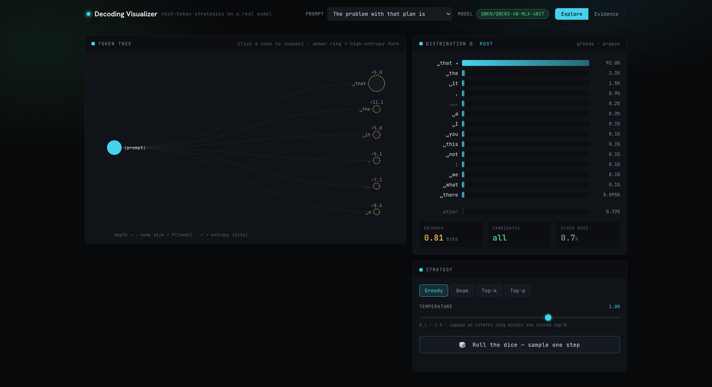
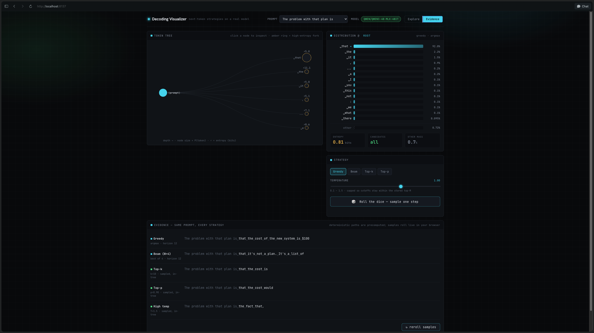

# Decoding Visualizer

> **▶ Live demo — [llm-decode-viz.vercel.app](https://llm-decode-viz.vercel.app/)**
> Explore all five strategies on six **stock prompts** right in your browser — no weights to
> download, no ranker to run. The per-prompt data was seeded once (generated on Apple Silicon) and
> is committed in the repo at [`site/data/`](site/data/) — `prompt0.json`–`prompt5.json` plus the
> `index.json` manifest.

An interactive, client-side visualizer that shows a **real language model's** next-token
probability distribution and demonstrates how five decoding strategies — **greedy, beam search,
top-k, top-p (nucleus), and temperature** — actually pick tokens from it.

The idea that drives the whole tool: **decoding is what you do at *uncertain* steps.** When the
distribution is sharp, every strategy agrees. At flat "fork points," they diverge. This makes
that visible — built as concrete, screenshot-able evidence for a blog post on decoding.

The model (`Qwen/Qwen3-4B-MLX-4bit`) runs **once, at build time**, to emit static JSON. The
website does *all* the decoding math live in the browser — no server, no model at runtime.

---

## How to read the visualizer

### Explore mode



The screen is one prompt, inspected three ways:

**① Token tree (left).** Starts at the prompt and branches the top-6 next tokens to depth 4.
- **Node size ∝ probability** of the token that leads to it — big nodes are likely picks.
- **Amber ⚡ ring = a fork** (high entropy): the model is genuinely unsure here, so the strategies
  diverge. The ⚡ number is the entropy in bits.
- The **cyan spine** is your current path. **Click any node to drill into it** — its children fan
  out to the right and its distribution loads on the right.

**② Distribution panel (right top).** The selected node's next-token distribution, top 14 bars of
the stored top-100.
- **Bar length = probability.** The **◂** marks greedy's pick (always the top bar).
- **Green bars = *kept* by the current strategy** (the nucleus for top-p, the top-k set); **grey
  bars = cut.** The dashed amber line is the cutoff.
- **Readout:** `entropy` (bits — how unsure the model is at this step), `kept` (how many tokens
  survive the cut), `other mass` (probability outside the stored top-100).

**③ Strategy controls (right bottom).**
- **Tabs** switch strategy: Greedy / Beam / Top-k / Top-p.
- **temperature** reshapes *every* bar live — low (<1) sharpens toward greedy, high (>1) flattens
  toward uniform. Watch a nucleus *widen* as you raise it.
- **top-k / top-p** sliders move the green/grey cutoff live.
- **🎲 Roll the dice** samples one token from the kept set and descends the tree to it — *you* are
  the sampler, walking inside the precomputed bounds.

**Things to try:** pick **"na na na na"** — the tree is a near-deterministic spine (greedy loops).
Pick **"The first thing I noticed was"** — fat amber forks where many continuations are plausible.
Crank temperature on a sharp node and watch the nucleus grow.

### Evidence mode



The same prompt run through every strategy, side by side — the figure the blog screenshots.
- **Greedy** and **Beam** are the precomputed deterministic continuations (12 tokens). Repetition
  is marked in **red** — that's claim #1, greedy/beam go bland and loopy.
- **Top-k / Top-p / High-temp** roll **live in your browser** and diversify. Hit **↻ reroll** to
  watch them change every time.
- The dim text is your prompt (the seed); the bright text is what the model generated. `␣` is a
  space and `↵` a newline, so the tokenization stays visible.

### What each claim looks like

| Claim | Where to see it |
|---|---|
| Greedy & beam are likely but bland/loopy | Evidence rows for `na na na na`, `1.` — greedy repeats |
| Top-k is rigid, top-p adapts | Switch tabs on a fork node: top-k always keeps *k*; top-p's nucleus shrinks when sharp, grows when flat |
| Temperature reshapes the distribution | Drag the temperature slider — all bars sharpen/flatten live |
| Entropy/shape drives everything | The `entropy` stat + the amber fork rings; high entropy = where strategies disagree |

---

## Architecture

A hard line between **build time** and **runtime**:

```
┌─ build time (once, on Apple Silicon) ─┐      ┌─ runtime (every reader's browser) ─┐
│  precompute/  ──MLX──>  Qwen3-4B-4bit │      │  site/  loads JSON, does ALL the   │
│  curated prompts → per-prompt JSON ───┼─────>│  decoding math in JS. No backend.  │
└───────────────────────────────────────┘      └────────────────────────────────────┘
```

- **`precompute/`** — a Python/MLX pipeline. Runs the model over a candidate corpus, scores each
  prompt by *fork-entropy* and *greedy-loopiness*, keeps the best, and for each builds a bounded
  token tree (depth-first with KV-cache reuse), a greedy path, and beam hypotheses — emitting one
  JSON file per prompt. **The model is the only heavy step, and it runs here, once.**
- **`site/`** — a static, dependency-free frontend (`index.html` + CSS + ES modules). It loads a
  prompt's JSON and recomputes softmax / temperature / top-k / top-p live. `site/js/strategies.js`
  is a direct JS mirror of `precompute/decoding.py`, so the browser math matches the Python.
- **Why this works statically:** temperature/top-k/top-p at a single node are pure functions of
  that node's stored distribution. Storing per-node logits + the full-vocab `logsumexp` + the tail
  mass lets the browser reconstruct *true* probabilities and recompute every cutoff with no server.

See `docs/superpowers/specs/` and `docs/superpowers/adr/` for the design spec and the locked
architectural decisions.

---

## Repo layout

```
precompute/                 # build-time MLX pipeline (Python)
  main.py                   # orchestration: rank prompts → build tree/greedy/beam → write JSON
  model.py                  # MLX model wrapper (context → logits)
  distribution.py           # per-node storage: top-M logits, logsumexp, tail mass, entropy
  decoding.py               # softmax, temperature, greedy, top-k, top-p, sampling
  beam.py                   # beam search (width 4, to the 12-token horizon)
  tree.py                   # bounded token tree (KV-cache reuse) + greedy continuation
  scoring.py                # fork-entropy + greedy-loopiness, used to curate prompts
  schema.py / export.py     # JSON data contract + serialization
  vocab.py                  # token id → display string
  data/candidate_prompts.json   # the corpus the ranker chooses from
  tests/                    # pytest (distribution / decoding / beam)
site/                       # runtime static frontend
  index.html  css/style.css
  js/{data,strategies,tree,distribution,controls,evidence,main}.js
  data/                     # generated per-prompt JSON + index.json manifest
deploy.sh                   # vercel --prod

docs/superpowers/           # spec, ADRs, plan
```

---

## Run it locally

**View the site** (no model needed — the JSON is committed):

```bash
python3 -m http.server 8137 --directory site
# open http://localhost:8137   (must be served over http, not file://)
```

**Regenerate the data** (needs Apple Silicon + MLX; downloads `Qwen3-4B-MLX-4bit` on first run):

```bash
cd precompute
uv run python main.py          # ranks the corpus, builds trees, writes site/data/prompt*.json
uv run pytest                  # distribution / decoding / beam tests
```

**Deploy** to a public Vercel URL:

```bash
vercel login                   # one-time
bash deploy.sh                 # cd site && vercel --prod
```

---

## How prompts get chosen

The corpus in `precompute/data/candidate_prompts.json` is scored by two build-time metrics
(`scoring.py`):

- **fork-entropy** — the peak full-vocab entropy over the first few greedy steps. High = the model
  has a genuinely uncertain step where strategies will diverge.
- **greedy-loopiness** — `max(rep₂, rep₃)` over the greedy continuation (fraction of bi/tri-grams
  that recur). High = greedy degenerates into repetition.

Both are z-scored across the corpus, combined (fork-weighted), and the top prompts are selected so
the set is **guaranteed** to contain at least one clear fork *and* one clear loop. Sharp factual
prompts ("2 + 2 =") act as negative controls and are filtered out.

---

*Built with `Qwen/Qwen3-4B-MLX-4bit`. Logits are 4-bit-quantized and labeled as such in the UI.
The precompute / decoding core was hand-implemented as a learning exercise; the frontend is normal-build.*
